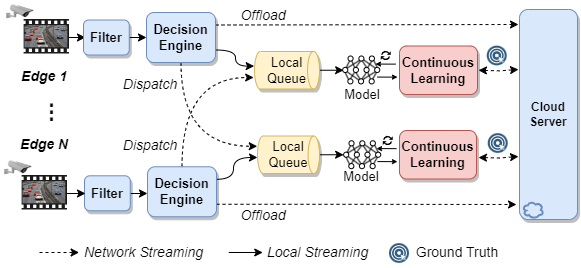
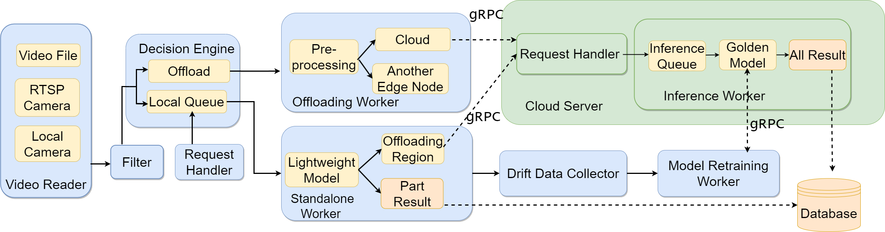

# Plank-Road

Plank-Road is a distributed edge-cloud video analytics system with drift-aware continual learning and graph-based split execution.

The current implementation uses a fixed split plan that is computed once at startup, structured edge-local sample storage, and a versioned upload contract for continual learning.

## Overview

<div align="center">

</div>

The runtime is organized as three chains:

1. Edge preprocessing:
   `input -> differencing/filtering -> local inference queue`
2. Edge inference with a fixed split plan:
   local inference always produces `intermediate feature + final result + confidence`
3. Lyapunov-based continual learning trigger:
   decides `train_now` and `send_low_conf_features`

The edge no longer uses normal cloud inference offloading as a branch after filtering. Filtered frames always enter the local inference queue first.

<div align="center">

</div>

## Current Architecture

### 1. Fixed Split Planning At Startup

The split point combination is fixed for a given model and constraint pair.

At startup, the edge:
- traces the model graph with TorchLens
- enumerates legal graph-cut candidates
- validates replayability
- selects the candidate that minimizes intermediate feature size
- enforces:
  - privacy leakage upper bound
  - maximum layer freezing ratio upper bound
- persists the result to `fixed_split_plan.json`

Runtime inference does not adaptively switch split points.

Core files:
- [model_management/fixed_split.py](./model_management/fixed_split.py)
- [model_management/universal_model_split.py](./model_management/universal_model_split.py)
- [model_management/split_runtime.py](./model_management/split_runtime.py)
- [model_management/candidate_generator.py](./model_management/candidate_generator.py)
- [model_management/candidate_profiler.py](./model_management/candidate_profiler.py)
- [model_management/split_candidate.py](./model_management/split_candidate.py)

### 2. Edge Inference And Local Sample Storage

Each inference sample produces:
- split intermediate feature
- final detection result
- sample confidence

Samples are stored locally on the edge with different policies:
- high-confidence: `feature + result`
- low-confidence: `feature + result + raw sample`
- drift samples: flagged in metadata and included in upload selection

Local storage is structured so the edge can batch:
- high-confidence feature/result pairs
- low-confidence feature/result/raw triplets
- drift samples

Core files:
- [edge/edge_worker.py](./edge/edge_worker.py)
- [edge/sample_store.py](./edge/sample_store.py)
- [model_management/object_detection.py](./model_management/object_detection.py)

### 3. Lyapunov-Based Training Decision

The resource-aware trigger no longer chooses a split point.

It now decides:
- whether continual learning should trigger now
- whether low-confidence samples should also upload intermediate features

Invariants:
- when training is triggered, high-confidence features and results are always uploaded
- low-confidence raw samples are always available for upload
- low-confidence feature upload is conditional

Preferences encoded in the trigger:
- tight cloud compute:
  avoid training, but if training happens prefer `raw + feature`
- tight bandwidth:
  avoid training, but if training happens prefer `raw only`

The controller maintains two virtual queues:
- `Q_cloud` for cloud resource pressure against `lambda_cloud`
- `Q_bw` for bandwidth pressure against `lambda_bw`

Core file:
- [edge/resource_aware_trigger.py](./edge/resource_aware_trigger.py)

### 4. Versioned Continual Learning Bundle

When continual learning is triggered, the edge uploads a versioned bundle containing:
- high-confidence features + results
- low-confidence raw samples + results
- optional low-confidence features
- drift flags and split-plan metadata

The server supports two low-confidence modes:
- `raw-only`
- `raw+feature`

In `raw-only` mode, the server reconstructs missing low-confidence features from uploaded raw samples before split-tail retraining. In both `raw-only` and `raw+feature` modes, the server annotates low-confidence raw samples with the large model because their pseudo-labels are often empty or unreliable.

Core files:
- [edge/transmit.py](./edge/transmit.py)
- [model_management/continual_learning_bundle.py](./model_management/continual_learning_bundle.py)
- [grpc_server/protos/message_transmission.proto](./grpc_server/protos/message_transmission.proto)
- [grpc_server/rpc_server.py](./grpc_server/rpc_server.py)
- [cloud_server.py](./cloud_server.py)

## Project Structure

```text
Plank-road/
├── edge_client.py            # Edge client entry (supports --edge_id override)
├── cloud_server.py            # Cloud server entry
├── launch_multi_edge.py       # Multi-edge launcher (start N edges at once)
├── config/
├── cloud/
│   └── edge_registry.py       # Cloud-side edge node registry
├── edge/
│   ├── edge_worker.py
│   ├── resource_aware_trigger.py
│   ├── sample_store.py
│   └── transmit.py
├── grpc_server/
│   ├── protos/
│   │   └── message_transmission.proto
│   ├── message_transmission_pb2.py
│   ├── message_transmission_pb2_grpc.py
│   ├── rpc_server.py
│   └── training_jobs.py       # Async job queue with round-robin scheduling
├── difference/
├── tools/
├── model_management/
│   ├── activation_sparsity.py
│   ├── continual_learning_bundle.py
│   ├── fixed_split.py
│   ├── graph_ir.py
│   ├── split_candidate.py
│   ├── payload.py
│   ├── candidate_generator.py
│   ├── candidate_profiler.py
│   ├── split_runtime.py
│   ├── universal_model_split.py
│   ├── object_detection.py
│   └── model_zoo.py
└── tests/
```

## Installation

### Recommended Environment

The graph-based split runtime has been validated with:
- `torchlens==1.0.1`
- `numpy==1.26.4`
- `opencv-python==4.11.0.86`

These versions are pinned in [requirements.txt](./requirements.txt).

### Create A Virtual Environment

```bash
pip install uv
uv venv
```

Activate the environment:

```bash
# Linux / macOS
source .venv/bin/activate

# Windows PowerShell
.venv\Scripts\Activate.ps1
```

### Install Dependencies

```bash
uv pip install -r requirements.txt
```

### Compile gRPC Stubs

```bash
uv pip install grpcio-tools

python -m grpc_tools.protoc \
    -I ./grpc_server/protos \
    --python_out=./grpc_server \
    --pyi_out=./grpc_server \
    --grpc_python_out=./grpc_server \
    ./grpc_server/protos/message_transmission.proto
```

Windows PowerShell:

```powershell
python -m grpc_tools.protoc `
    -I ./grpc_server/protos `
    --python_out=./grpc_server `
    --pyi_out=./grpc_server `
    --grpc_python_out=./grpc_server `
    ./grpc_server/protos/message_transmission.proto
```

## Configuration

### Models

```yaml
client:
  lightweight: yolov8s

server:
  golden: yolov8x
  workspace_root: ./cache/server_workspace
  edge_model_name: yolov8s
  continual_learning:
    teacher_annotation_threshold: 0.3
```

### Fixed Split Planning

```yaml
client:
  split_learning:
    enabled: True
    fixed_split:
      privacy_leakage_upper_bound: 0.15
      max_layer_freezing_ratio: 0.75
      validate_candidates: True
      max_candidates: 24
      max_boundary_count: 8
      max_payload_bytes: 33554432
      privacy_leakage_epsilon: 1.0e-12
```

### Resource-Aware Trigger

```yaml
client:
  resource_aware_trigger:
    enabled: True
    lambda_cloud: 0.5
    lambda_bw: 0.5
    w_cloud: 1.0
    w_bw: 1.0
    min_training_samples: 10
    drift_bonus: 0.35
    upload_time_budget_sec: 5.0
```

### Dynamic Activation Sparsity

```yaml
server:
  das:
    enabled: True
    bn_only: False
    probe_samples: 10
```

### Wrapper Fixed-Split Retraining

```yaml
server:
  continual_learning:
    num_epoch: 2
    teacher_annotation_threshold: 0.3
    min_wrapper_fixed_split_num_epoch: 10
    wrapper_fixed_split_learning_rate: 3.0e-5
```

## Runtime Flow

### Edge Startup

1. Build the lightweight detection model
2. Trace the model graph
3. Compute or load the fixed split plan
4. Validate the selected split plan
5. Start:
   - differencing thread
   - local inference worker
   - continual learning worker

### Continual Learning Trigger

When the trigger fires:
- high-confidence features + results are always bundled
- low-confidence raw samples are always bundled
- low-confidence features are bundled only if `send_low_conf_features=True`
- drift samples are marked in the bundle manifest

### Cloud Retraining

The cloud:
1. receives the versioned bundle
2. expands it into a working cache
3. reconstructs low-confidence features if necessary
4. annotates drift samples, plus low-confidence raw samples in both low-confidence modes, with the large model
   using `teacher_annotation_threshold`
5. detects fully-collapsed wrapper checkpoints and falls back to native pretrained weights for that retrain round
6. runs split-tail retraining
7. logs a before/after proxy `mAP@0.5` summary on the GT-annotated subset
8. returns updated edge model weights

## Usage

### Single Edge (Default)

Single-edge usage is unchanged. No extra arguments or configuration needed:

```bash
# Terminal 1: Start the cloud server
python cloud_server.py

# Terminal 2: Start the edge client
python edge_client.py
```

This uses `edge_id: 1` and `cache_path: ./cache` from `config/config.yaml` by default.

### Multi-Edge Deployment

Multiple edge nodes can run concurrently against the same cloud server. Each edge must have a **unique `edge_id`** and **separate `cache_path`** to avoid data conflicts.

#### Option A: One-Command Launcher

Use `launch_multi_edge.py` to start N edge processes at once:

```bash
# Start 3 edges (edge_id=1,2,3) all using the same video source
python launch_multi_edge.py --num_edges 3

# Start 3 edges with different video sources
python launch_multi_edge.py --num_edges 3 \
    --video_paths video_data/road1.mp4 video_data/road2.mp4 video_data/road3.mp4

# Start edges with custom IDs (e.g., 10,11,12)
python launch_multi_edge.py --num_edges 3 --start_edge_id 10

# Override the cloud server address for all edges
python launch_multi_edge.py --num_edges 4 --server_ip 10.0.0.5:50051
```

The launcher automatically:
- Assigns unique `edge_id` to each process
- Isolates cache directories to `./cache/edge_{id}/`
- Writes per-edge logs to `log/client/edge_{id}_*.log`
- Handles graceful shutdown on Ctrl+C

#### Option B: Manual Per-Edge Start

Start each edge in a separate terminal with `--edge_id`:

```bash
# Terminal 2: Edge 1
python edge_client.py --edge_id 1

# Terminal 3: Edge 2
python edge_client.py --edge_id 2 --video_path video_data/road2.mp4

# Terminal 4: Edge 3 (custom cache and server)
python edge_client.py --edge_id 3 --cache_path ./cache/edge_3 --server_ip 10.0.0.5:50051
```

When only `--edge_id` is specified, the cache path is automatically set to `./cache/edge_{id}` to ensure isolation.

Available CLI overrides:

| Argument | Description | Default |
|----------|-------------|---------|
| `--edge_id` | Unique edge node ID | from config (`1`) |
| `--cache_path` | Per-edge cache directory | `./cache/edge_{id}` |
| `--video_path` | Video source for this edge | from config |
| `--server_ip` | Cloud server address | from config |

### Multi-Edge Cloud Configuration

For multi-edge deployments, the cloud server should be configured with sufficient concurrency:

```yaml
server:
  continual_learning:
    # Set to the number of edges for full parallelism,
    # or lower to share GPU across edges
    max_concurrent_jobs: 4
  # gRPC workers should exceed max_concurrent_jobs to avoid
  # status queries being blocked by training threads
  grpc_max_workers: 16
```

### Multi-Edge Behavior

- **Scheduling**: Different edges' training jobs run in parallel (up to `max_concurrent_jobs`). Jobs from the same edge are serialized to prevent model version conflicts.
- **Fairness**: Round-robin scheduling ensures all edges get equal training opportunities.
- **Version safety**: The system tracks `base_model_version` → `result_model_version`. If an edge's model advances while a training job is still running, the result is marked **STALE** and discarded automatically.
- **Resource awareness**: Each edge independently queries cloud resource utilization before submitting training jobs, providing natural load balancing via the Lyapunov-based trigger.
- **Backward compatibility**: All multi-edge features are additive. Single-edge deployments work exactly as before with no configuration changes.

## Testing

Core coverage includes:
- [tests/test_edge.py](./tests/test_edge.py)
- [tests/test_grpc_server.py](./tests/test_grpc_server.py)
- [tests/test_continual_learning_pipeline.py](./tests/test_continual_learning_pipeline.py)
- [tests/test_split_runtime_edge_cloud_pipeline.py](./tests/test_split_runtime_edge_cloud_pipeline.py)

Focused validation command:

```bash
.venv\Scripts\python.exe -m pytest \
    tests/test_edge.py \
    tests/test_grpc_server.py \
    tests/test_continual_learning_pipeline.py \
    tests/test_split_runtime_edge_cloud_pipeline.py::test_feature_transfer_and_weight_download_over_grpc -q
```

## References

- [EdgeCam](https://github.com/MSNLAB/EdgeCam)
- [TorchLens](https://github.com/johnmarktaylor91/torchlens)
- [SURGEON](https://github.com/kadmkbl/SURGEON)
- [RCCDA](https://github.com/Adampi210/RCCDA_resource_constrained_concept_drift_adaptation_code)
- [Shawarma](https://github.com/Shawarma-sys/Shawarma)
