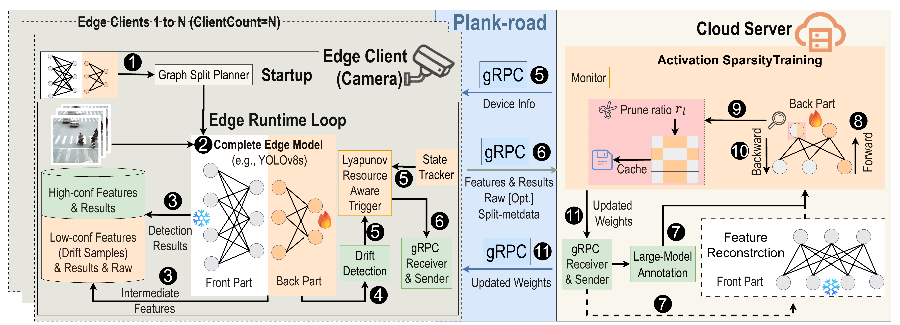

# Plank-Road

Plank-Road is a multi-edge edge-cloud video analytics system for drift-aware continual learning under resource constraints. It targets low-latency edge inference and on-demand cloud adaptation when bandwidth, edge compute, and privacy-constrained cloud training resources are limited.

The implementation combines startup-time fixed split planning, structured edge sample caching, a Lyapunov resource-aware trigger, gRPC training bundles, shard-backed feature cache, split-tail cloud retraining, and optional dynamic activation sparsity.

## Overview

<div align="center">

</div>

At startup, each edge client traces the lightweight detector and selects a fixed computation-graph split plan. The selected boundary minimizes intermediate feature transfer cost while satisfying privacy constraints on feature leakage and trainability constraints that keep enough server-side tail layers available for continual learning.

During online execution, video frames pass through differencing/filtering before entering the local inference queue. Edge inference produces intermediate features, detection results, output entropy, and boundary-feature entropy. Trusted edge pseudo-label samples are cached as `feature + result`; teacher-needed samples keep `feature + result + raw sample`; drift-related samples are marked in metadata.

The continual-learning trigger combines teacher-needed sample rate, drift signals, cloud resource pressure, upload volume, and link bandwidth. Its Lyapunov controller decides whether to skip training, upload teacher-needed raw samples only, or upload teacher-needed raw samples together with intermediate features.

When training is triggered, the edge sends a gRPC bundle with cached features/results, teacher-needed raw samples, optional teacher-needed features, drift tags, and split metadata. The cloud annotates teacher-needed raw samples with the large model, reconstructs missing features when needed, retrains the split-tail network, optionally applies dynamic activation sparsity, and returns updated lightweight weights to the originating edge.

## Quick Start

Python, `uv`, `pytest`, server, and client examples below are written as single-line invocations so they can be copied into Linux Bash, Windows PowerShell, or Windows CMD. CUDA MPS setup and shutdown are Linux CUDA host commands and are labeled separately. Replace sample host values such as `192.168.66.205` with your cloud machine IP before real deployment.

Install dependencies with `uv`:

```shell
python -m pip install --upgrade uv
uv sync --all-extras
```

Run a single edge against one cloud server:

Cloud terminal:

```shell
python cloud_server.py --yaml_path ./config/config.yaml --edge_affine_workers_enabled true --edge_affine_worker_mode edge_affine_single_gpu_mps
```

Edge terminal:

```shell
python edge_client.py --headless
```

Runtime defaults come from [config/config.yaml](./config/config.yaml), including video source, model choices, split-learning settings, resource trigger budgets, cloud workspace paths, and gRPC addresses.

Generated gRPC files are committed under [grpc_server/](./grpc_server/). Rebuild them only after changing [grpc_server/protos/message_transmission.proto](./grpc_server/protos/message_transmission.proto):

```shell
python -m grpc_tools.protoc -I ./grpc_server/protos --python_out=./grpc_server --pyi_out=./grpc_server --grpc_python_out=./grpc_server ./grpc_server/protos/message_transmission.proto
```

## Architecture

### Startup Split Planning

The edge prepares a TorchLens-native split runtime, enumerates graph boundary candidates, validates replayability, and persists the selected plan to `fixed_split_plan.json`. The fixed plan is reused during runtime; split points are not switched adaptively per frame.

Core areas: [model_management/fixed_split.py](./model_management/fixed_split.py), [model_management/candidate_selector.py](./model_management/candidate_selector.py), [model_management/split_runtime/](./model_management/split_runtime/).

### Edge Runtime And Sample Cache

The edge runtime filters incoming frames, performs local detection, stores entropy-classified pseudo-label trust buckets, and prepares feature shards for later upload. Window-level drift and teacher-needed sample rate decide when samples matter for continual learning.

Core areas: [edge/edge_worker.py](./edge/edge_worker.py), [edge/sample_store.py](./edge/sample_store.py), [edge/feature_shard/](./edge/feature_shard/).

### Resource-Aware Continual Learning Trigger

The trigger gates continual learning with teacher-needed sample rate, drift state, cloud utilization, and bandwidth estimates. It maintains cloud and bandwidth virtual queues and chooses whether teacher-needed features should be included in the training bundle.

Core areas: [edge/resource_aware_trigger.py](./edge/resource_aware_trigger.py), [edge/window_drift_detector.py](./edge/window_drift_detector.py), [cloud/global_resource_manager.py](./cloud/global_resource_manager.py).

### Cloud Training Pipeline

The cloud receives training bundles, expands the working cache, annotates selected raw samples, rebuilds missing features, creates direct-reference training views, and retrains the server-side tail behind the selected split boundary.

Core areas: [cloud/orchestration/](./cloud/orchestration/), [cloud/annotation/](./cloud/annotation/), [cloud/feature_cache/](./cloud/feature_cache/).

### Model Update And Multi-Edge Safety

Cloud training jobs are routed by `edge_id` into the edge-affine worker pool. Each edge gets an isolated worker process, and the GPU lease manager decides how many workers may enter CUDA-heavy fixed-split stages.

Core areas: [grpc_server/training_jobs.py](./grpc_server/training_jobs.py), [grpc_server/rpc_server.py](./grpc_server/rpc_server.py), [cloud/workers/](./cloud/workers/).

## Project Structure

```text
Plank-road/
|-- edge_client.py              # Real edge-device client entry point
|-- cloud_server.py             # Cloud gRPC server entry point
|-- config/                     # Runtime YAML/config loaders
|-- edge/                       # Edge runtime, quality/drift logic, trigger, feature shards
|   `-- feature_shard/          # Edge-side safetensors/npy feature shard writers
|-- cloud/                      # Cloud ingest, orchestration, resource state, model updates
|   |-- annotation/             # Teacher annotation service and label cache
|   |-- baselines/              # Cloud-side baseline controllers, including Ekya-style scheduling
|   |-- feature_cache/          # Cloud feature shard store, planner, materializer, GC
|   |-- orchestration/          # Fixed-split training pipeline stages
|   `-- workers/                # Edge-affine workers, assignment, MPS, GPU leases
|-- grpc_server/                # Protobuf contract, RPC server, jobs, workspace helpers
|   `-- protos/                 # message_transmission.proto and generated stubs
|-- model_management/           # Detectors, inference helpers, fixed split, DAS, runtimes
|   |-- detectors/
|   |-- inference/
|   `-- split_runtime/
|-- baselines/                  # Distributed baseline policies and edge/cloud runtime
|   |-- policies/               # Comparison-method decisions only
|   `-- distributed/            # Physical edge/cloud baseline transport and state
|-- tools/                      # Experiment, plotting, benchmark, and preprocessing scripts
|-- scripts/                    # Figure/plot helpers
|-- tests/                      # Unit, integration, and pipeline tests
|-- docs/                       # Design notes and rendered overview image
`-- video_data/                 # Checked-in sample videos used by examples
```

## Configuration

The default runtime config is [config/config.yaml](./config/config.yaml). The key settings below are representative; use the YAML file as the source of truth for full options.

```yaml
client:
  lightweight: rfdetr_nano
  weights_path: ./model_management/models/rf-detr-nano.pth
  edge_id: 1
  server_ip: "192.168.66.205:50051"
  retrain:
    cache_path: ./cache
    min_low_quality_samples: 80

server:
  golden: rtdetr_x
  edge_model_name: rfdetr_nano
  weights_path: ./model_management/models/rf-detr-nano.pth
  listen_address: "[::]:50051"
  grpc_max_workers: 16
  workspace_root: ./cache/server_workspace
```

```yaml
client:
  split_learning:
    enabled: True
    fixed_split:
      privacy_leakage_upper_bound: 1.0e-6
      max_layer_freezing_ratio: 0.75
      validate_candidates: True
      max_boundary_count: 8
      max_payload_bytes: 33554432
```

```yaml
client:
  resource_aware_trigger:
    enabled: True
    V: 10.0
    K_p: 0.6
    K_d: 0.2
    lambda_cloud: 0.5
    lambda_bw: 0.5
    bundle_max_bytes: 134217728
    bundle_min_bytes: 8388608
    bundle_target_upload_sec: 45.0
```

```yaml
server:
  continual_learning:
    batch_size: 32
    max_concurrent_jobs: 1
    feature_cache:
      materialization_mode: direct_ref
      storage_format: safetensors_shard
      accepted_storage_formats:
        - safetensors_shard
        - npy_memmap_shard
  das:
    enabled: False
    strategy: entropy
  edge_affine_workers:
    enabled: true
    mode: edge_affine_single_gpu_mps
    gpu_lease:
      memory_usage_threshold: 0.85
      reserve_memory_gb: 4
      default_estimated_job_memory_gb: 18
```

Ekya-style cloud scheduling is configured under the cloud baseline section. It
streams JPEG frames from the edge, returns cloud inference results online, labels
completed windows with the teacher, microprofiles candidate hyperparameters, and
optionally adopts retrained student checkpoints.

```yaml
server:
  baselines:
    ekya_style_cloud_scheduling:
      edge_streaming:
        upload_queue_size: 8
      retraining:
        min_map_gain_to_adopt: 0.0
```

The baseline inherits shared experiment settings from the main Plank-Road
configuration: `server.edge_model_name`, `server.golden`, `experiment_run`,
`server.continual_learning`, `baseline.training`, and
`baseline.accuracy_trigger_cloud_retraining`.

## Usage

### Single Edge

Start the cloud server and one edge client:

Cloud terminal:

```shell
python cloud_server.py --yaml_path ./config/config.yaml --edge_affine_workers_enabled true --edge_affine_worker_mode edge_affine_single_gpu_mps
```

Edge terminal:

```shell
python edge_client.py --headless
```

Useful edge overrides:

| Argument | Purpose |
|----------|---------|
| `--edge_id` | Override `client.edge_id` for multi-edge isolation |
| `--cache_path` | Override `client.retrain.cache_path`; use one cache per edge |
| `--video_path` | Override `experiment_run.video_path` for this edge process |
| `--server_ip` | Override `client.server_ip` |
| `--max_count` | Override `experiment_run.max_count` for this edge process |
| `--headless` | Run without OpenCV display windows |

### Real Multi-Device Deployment

The supported Plank-Road topology is one cloud server plus one `edge_client.py` process on each physical edge device. The cloud uses the edge-affine worker pool: every `edge_id` gets a sticky isolated worker process, while GPU admission is controlled by `GpuLeaseManager` using the configured memory threshold, reserve budget, estimated peak memory, active leases, and lease heartbeat TTL. Worker processes bind their local JSON-RPC port before initializing heavy model/runtime objects, and `/health` reports `STARTING`, `READY`, `FAILED`, or `STOPPING` so the cloud can wait, retry on a new endpoint, or shut down cleanly without treating worker startup as a training result.

All edge devices connect to the same cloud gRPC address, and every edge device must use a unique `edge_id`. Reusing an `edge_id` across physical devices is invalid because the cloud identifies edge state, jobs, worker assignment, and model updates by `edge_id`.

The cloud `server.listen_address` must listen on an external interface, such as `[::]:50051` or `0.0.0.0:50051`; do not bind only to `127.0.0.1:50051` for real devices. Make sure the machine firewall or cloud security group allows inbound traffic on port `50051`.

Each real edge device has its own filesystem, so each device may use `./cache` locally. For clearer logs and debugging, prefer explicit per-edge paths such as `./cache/edge_1` and `./cache/edge_2`. Multiple edges may use different video files, camera sources, or the same configuration file, but their `edge_id` values must not repeat.

Start MPS on the Linux CUDA cloud machine:

```bash
export CUDA_VISIBLE_DEVICES=0 CUDA_MPS_PIPE_DIRECTORY=/tmp/nvidia-mps CUDA_MPS_LOG_DIRECTORY=/tmp/nvidia-mps-log && mkdir -p "$CUDA_MPS_PIPE_DIRECTORY" "$CUDA_MPS_LOG_DIRECTORY" && nvidia-cuda-mps-control -d
```

Start the cloud:

```shell
python cloud_server.py --yaml_path ./config/config.yaml --listen_address "[::]:50051" --edge_affine_workers_enabled true --edge_affine_worker_mode edge_affine_single_gpu_mps
```

Start each physical edge with a unique `edge_id`:

```shell
python edge_client.py --yaml_path ./config/config.yaml --edge_id 1 --server_ip 192.168.66.205:50051 --cache_path ./cache/edge_1 --video_path ./video_data/road.mp4 --headless
```

```shell
python edge_client.py --yaml_path ./config/config.yaml --edge_id 2 --server_ip 192.168.66.205:50051 --cache_path ./cache/edge_2 --video_path ./video_data/cam1-rin.mp4 --headless
```

```shell
python edge_client.py --yaml_path ./config/config.yaml --edge_id 3 --server_ip 192.168.66.205:50051 --cache_path ./cache/edge_3 --video_path "./video_data/sunny.mp4" --headless
```

When GPU memory approaches the configured threshold, additional edge workers wait until an active worker releases its lease. If a lease heartbeat expires, the lease is released automatically and the job is treated as retryable.

```text
Real deployment checklist:
1. Cloud server is reachable from every edge device.
2. server.listen_address is not loopback-only.
3. Every edge uses a unique edge_id.
4. Every edge points to the same server_ip.
5. Each edge has a valid local video/camera source.
6. Edge cache directories are not shared through NFS unless intentionally configured.
7. Cloud workspace_root has enough disk space for uploaded bundles and feature caches.
8. GPU concurrency is controlled by GpuLeaseManager.
9. Formal experiments should use explicit `experiment_id`, `scenario`, `edge_count`, and `repeat` values.
```

Shut MPS down with:

```bash
echo quit | nvidia-cuda-mps-control
```

### Distributed Baseline Deployment

Baselines are deployed using the same physical edge-cloud topology as Plank-Road, but they are separate comparison methods. Plank-Road itself is not registered as a `baseline_method`.

Before launching a formal experiment, choose one shared run identity for the
cloud and every edge device. It can be configured once at the top of
`config/config.yaml`:

```yaml
experiment_run:
  experiment_id: suwon5a_weather
  scenario: snowy
  video_path: ./video_data/snowy.mp4
  max_count: 2000
  edge_count: 1
  repeat: 1
```

CLI values such as `--scenario`, `--video_path`, `--max_count`, and `--repeat`
override `experiment_run`. The runtime run id is generated from those dimensions
and the method. Different repeated runs must use different `repeat` values.

The supported baseline methods are:

```text
pure_edge_local_updating
accuracy_trigger_cloud_retraining
ekya_style_cloud_scheduling
```

Cloud-backed baseline updates use the shared training-job API with one generic
baseline job type. The cloud-backed production baseline training strategy is
`training_strategy: freeze`; Pure Edge uses local `surgeon_tta`:

```yaml
baseline:
  edge:
    split_runtime_policy: disabled
  pure_edge_local_updating:
    training_strategy: surgeon_tta
    quality_mode: output_only_when_no_boundary
    trainable_scope: norm_affine
    consistency_weight: 0.01
    entropy_margin_ratio: 0.4
  accuracy_trigger_cloud_retraining:
    training_strategy: freeze
    training_failure_backoff_sec: 30
  training:
    batch_size: 32
    num_epoch: 50
    learning_rate: 1.0e-3
    optimizer_name: adam
    weight_decay: 0.0
    training_frame_count: 120
```

`accuracy_trigger_cloud_retraining` uses edge predictions only for trigger and
evaluation metadata; cloud training targets come from the cloud teacher unless
an explicit ablation opts into edge targets.

#### Accuracy-Trigger Cloud Retraining

Cloud:

```shell
python cloud_server.py --yaml_path ./config/config.yaml --mode baseline --baseline_method accuracy_trigger_cloud_retraining --listen_address "[::]:50051"
```

Accuracy-Trigger edge device 1:

```shell
python edge_client.py --yaml_path ./config/config.yaml --mode baseline --baseline_method accuracy_trigger_cloud_retraining --edge_id 1 --server_ip 192.168.66.205:50051 --cache_path ./cache/edge_1 --headless
```

Accuracy-Trigger edge device 2:

```shell
python edge_client.py --yaml_path ./config/config.yaml --mode baseline --baseline_method accuracy_trigger_cloud_retraining --edge_id 2 --server_ip 192.168.66.205:50051 --cache_path ./cache/edge_2 --video_path ./video_data/cam1-rin.mp4 --headless
```

#### Pure Edge Local Updating

```shell
python edge_client.py --yaml_path ./config/config.yaml --mode baseline --baseline_method pure_edge_local_updating --edge_id 1 --cache_path ./cache/edge_1 --headless
```

Pure Edge Local Updating writes metrics locally under
`results/baselines_distributed/{run_id}/pure_edge_local_updating/edge_{edge_id}/metrics.jsonl`
and mirrors experiment artifacts under `cache/experiment_results/...` when
experiment archival is enabled. It does not upload frames, metrics, teacher
requests, or shutdown artifacts to the cloud by default, so it can run without a
cloud server.

#### Ekya-Style Cloud Scheduling

The Ekya-style baseline uses a bidirectional gRPC stream. Each sampled edge frame
is uploaded as JPEG, the cloud immediately returns the student-model detection
result for display, and completed windows trigger teacher labeling,
microprofiling, scheduling, and optional retraining on the cloud. This path is
implemented under
[cloud/baselines/ekya_style_cloud_scheduling/](./cloud/baselines/ekya_style_cloud_scheduling/).

Cloud:

```shell
python cloud_server.py --yaml_path ./config/config.yaml --mode baseline --baseline_method ekya_style_cloud_scheduling --listen_address "[::]:50051"
```

Ekya-style edge:

```shell
python edge_client.py --yaml_path ./config/config.yaml --mode baseline --baseline_method ekya_style_cloud_scheduling --edge_id 1 --server_ip 192.168.66.205:50051 --headless
```

Cloud-side raw logs are written under
`results/cloud/{run_id}/baselines/ekya_style_cloud_scheduling/`, including
`per_frame_metrics.csv`, `per_window_metrics.csv`, `training_events.csv`,
`scheduler_events.csv`, `model_update_events.csv`, `upload_events.csv`,
`sampled_frames.json`, and `summary.json`. Edge display events are mirrored
under `results/edge/{run_id}/baselines/ekya_style_cloud_scheduling/`.

Convert one Ekya-style run into the existing plot schema with:

```shell
python tools/convert_ekya_style_results_to_plot_schema.py --run_id road_n1_r01_ekya_style_cloud_scheduling --result_dir results/cloud --experiment_id road_baselines --scenario_name road --video_slug road --append_to_normalized_dir results/experiments/road_baselines/normalized
```

## Experiment Post-processing and Figures

The baseline figure pipeline compares `plank_road`,
`pure_edge_local_updating`, `accuracy_trigger_cloud_retraining`, and
`ekya_style_cloud_scheduling`.

Start from
[configs/experiments/plank_road_baselines_manifest.example.yaml](./configs/experiments/plank_road_baselines_manifest.example.yaml).
The formal setup is Sunny/Rainy/Snowy, all four methods, and 3 to 5 repeats with
matching frame ranges per scenario.

```text
results/experiments/{experiment_id}/
  manifest.yaml
  raw_logs/
    {scenario_slug}_n{edge_count}_r{repeat}_{method}/
      cloud/
      edge_{edge_id}/
  normalized/
  figures/
```

`experiment_results.root_dir` is the cloud repository and
`experiment_results.local_root_dir` is the edge staging directory. Experiment
artifact upload is offline archival traffic. It does not enter sample ingestion,
teacher annotation, retraining, or `upload_breakdown.csv`. Pure Edge therefore
remains a zero-cloud-communication method for experiment metrics; by default it
stages result files locally after shutdown and skips cloud artifact upload.

Build teacher-supervised F1, normalize logs, and plot:

```shell
python tools/experiments/evaluate_plank_road_baseline_teacher_accuracy.py --comparison_dir results/experiments/{experiment_id} --manifest results/experiments/{experiment_id}/manifest.yaml --teacher_model rtdetr_x --device cuda:0 --update_manifest
python tools/experiments/normalize_plank_road_baseline_logs.py --comparison_dir results/experiments/{experiment_id} --manifest results/experiments/{experiment_id}/manifest.yaml
python tools/experiments/plot_plank_road_baseline_figures.py --normalized_dir results/experiments/{experiment_id}/normalized --figure_dir results/experiments/{experiment_id}/figures
```

After replacing files under `raw_logs/`, rerun the same three commands. Add
`--overwrite_teacher_cache` only when teacher labels should be regenerated.

The plotting command emits:

- `fig1_dynamic_accuracy_recovery.{svg,pdf,tiff,png}`
- `fig2_accuracy_retraining_time_tradeoff.{svg,pdf,tiff,png}`
- `fig3_retraining_time_breakdown.{svg,pdf,tiff,png}`
- `plot_report.json`

Teacher replay reports Teacher-supervised F1, not ground-truth accuracy, and is
excluded from online latency and communication metrics. Missing values stay
empty and skipped or partial figures are reported in `figures/plot_report.json`.

Ekya-style raw logs can be consumed directly by the normalizer when the matrix
manifest includes method `ekya_style_cloud_scheduling` and the raw files are in
the generated `{scenario_slug}_n{edge_count}_r{repeat}_ekya_style_cloud_scheduling`
directory. For ad hoc
conversion, use
`tools/convert_ekya_style_results_to_plot_schema.py`; it writes the same
canonical method identity.

Legacy external Ekya summary data uses
[configs/experiments/external_ekya_schema.example.csv](./configs/experiments/external_ekya_schema.example.csv)
and is excluded from default plots. Use this only for measurements generated
outside this repository. Import it explicitly with:

```shell
python tools/experiments/merge_external_ekya_results.py --plank_road_summary results/experiments/{experiment_id}/normalized/summary.csv --ekya_csv path/to/external_ekya_results.csv --output results/experiments/{experiment_id}/normalized/summary_with_external_ekya.csv
```

Detailed specifications:

- [Experiment design](./docs/experiments/plank_road_baselines_experiment_design.md)
- [Figure specification](./docs/experiments/plank_road_baselines_plot_spec.md)
- [External Ekya schema](./docs/experiments/external_ekya_data_schema.md)

## Testing

Run the full test suite:

```shell
pytest
```

Core coverage includes cloud contracts/orchestration, feature shard and cache handling, fixed-split runtime and retraining, teacher annotation, baseline metrics, and edge/cloud gRPC behavior.

Run the experiment post-processing tests without starting edge/cloud services:

```shell
pytest -q tests/experiments
```

Focused validation command:

```shell
pytest tests/test_cloud_contracts.py tests/test_orchestration_refactor.py tests/test_edge_feature_shard_writer.py tests/test_cloud_feature_shard_receive.py tests/test_fixed_split_retrain_engine.py tests/test_teacher_annotation_service.py tests/test_baseline_metrics.py tests/test_low_quality_trigger_bundle.py tests/test_fixed_split_e2e_processes.py
```

## References

- [EdgeCam](https://github.com/MSNLAB/EdgeCam)
- [TorchLens](https://github.com/johnmarktaylor91/torchlens)
- [SURGEON](https://github.com/kadmkbl/SURGEON)
- [RCCDA](https://github.com/Adampi210/RCCDA_resource_constrained_concept_drift_adaptation_code)
- [Shawarma](https://github.com/Shawarma-sys/Shawarma)
